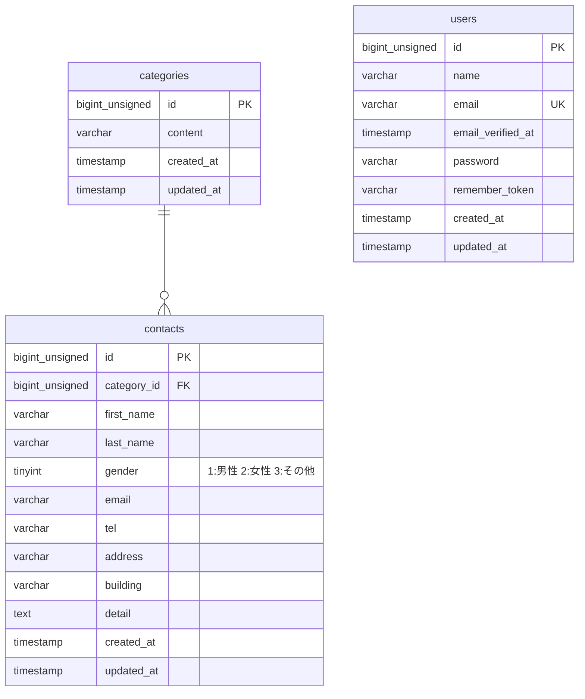

# Basic Test App

## 環境構築

### Docker ビルド

```bash
git clone git@github.com:mattyopon/basic-test.git
cd basic-test
docker-compose up -d --build
```

- MySQL のデータディレクトリは `~/coachtech-basic-test-mysql-data` に保存されます。初回起動時は自動的にディレクトリが作成されます。
- **重要**: Windows ファイルシステム（`/mnt/c/`）では権限の問題で MySQL が起動しない場合があります。その場合は、docker-compose.yml の MySQL ボリュームパスを `~/coachtech-basic-test-mysql-data` に設定してください（既に設定済み）。

### Laravel 環境構築

```bash
docker-compose exec php bash
composer install
```

`.env.example`ファイルから`.env`を作成し、環境変数を変更

```bash
cd /var/www
cp .env.example .env
php artisan key:generate
php artisan migrate
php artisan db:seed
```

**注意事項:**

- `composer install`は`/var/www`ディレクトリで実行してください
- `.env`ファイルの作成と`php artisan`コマンドも`/var/www`ディレクトリで実行してください
- MySQL のデータディレクトリは`~/coachtech-basic-test-mysql-data`に保存されます。初回起動時は自動的にディレクトリが作成されます

## 使用技術(実行環境)

- PHP 8.1
- Laravel 8.75
- Laravel Fortify 1.13
- Laravel Sanctum 2.11
- MySQL 8.0.26
- Nginx 1.21.1
- phpMyAdmin
- Docker / Docker Compose

## ER 図



## URL

- 開発環境：http://localhost/
- phpMyAdmin：http://localhost:8080/
